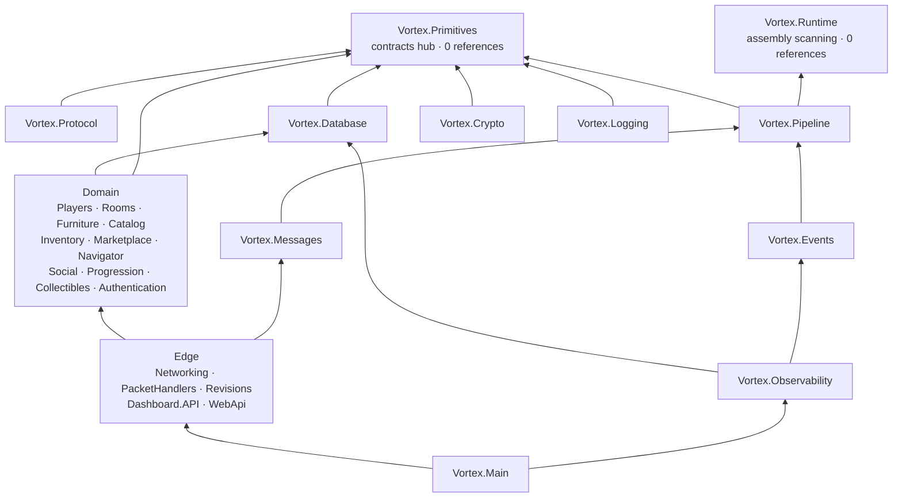

# Solution map

## Purpose

Which of the 49 projects owns what, and which are not what their name suggests.

## Read this first

**Four projects produce an executable.** Everything else is a library, however service-like the name
sounds. `Vortex.Dashboard.API` and `Vortex.WebApi` in particular are *libraries* — they use
`<FrameworkReference Include="Microsoft.AspNetCore.App" />` and build their `WebApplication` inside
the emulator's process; they do not have a `Main`.

| Executable | SDK | Role |
|---|---|---|
| `Vortex.Main` | default | the emulator: composition root, Orleans silo, all listeners |
| `Vortex.Supervisor` | `Microsoft.NET.Sdk.Web` | a *separate process* that starts/stops/restarts `Vortex.Main` |
| `Vortex.LoadGen` | default | out-of-process synthetic client fleet |
| `Vortex.Specs.Cli` | default | dev-time spec generator; referenced by nothing at runtime |

Evidence: `<OutputType>Exe</OutputType>` appears in exactly those four `.csproj`. Full table:
[Project index](../generated/project-index.md).

## Layers



**No cycles.** `Vortex.Primitives` and `Vortex.Runtime` are the only projects with zero project
references; 46 of 49 reference `Vortex.Primitives`.

## By solution folder

The solution's own seven folders (`Vortex.Cloud.sln`, `NestedProjects`) are the intended grouping.

### 1 Host

| Project | Owns |
|---|---|
| `Vortex.Main` | `Program.cs` composition, Orleans silo config, DI and hosted-service ordering, console commands, the `VortexEmulator` hosted service that opens the game sockets last |
| `Vortex.Supervisor` | a parent process: child lifecycle, stdin-driven graceful shutdown, console relay over SSE, `/health` polling. Deliberately outside the emulator — "nothing living inside a process can restart that process" |

### 2 Protocol

| Project | Owns |
|---|---|
| `Vortex.Protocol` | 1093 message and composer files (534 `IMessageEvent` + 552 `IComposer`). Split out of `Vortex.Primitives` so wire churn cannot reach the contracts hub |
| `Vortex.Messages` | the message registry and dispatch; discovers `IMessageHandler<>` by assembly scan; rate limiting |
| `Vortex.Revisions` | `Revision20260701` — parsers, serializers, `Headers.cs`, 43 domain maps. The **embedded default** revision |
| `Vortex.PacketHandlers` | 539 orchestration-only handlers |

### 3 Domain

| Project | Owns |
|---|---|
| `Vortex.Players` | identity, wallet, presence, effects, club, directory, server config |
| `Vortex.Rooms` | `RoomGrain` (28 partials, 26 modules/systems), the wired engine, furniture logic, minigames, CFH, chatlogs |
| `Vortex.Furniture` | furniture definitions provider and lookup |
| `Vortex.Catalog` | catalog snapshots, club offers, targeted offers, LTD raffles, vouchers, purchase |
| `Vortex.Inventory` | player item inventory, gifts, trading inventory |
| `Vortex.Marketplace` | offers and settlement |
| `Vortex.Navigator` | room search, categories, room ads |
| `Vortex.Social` | messenger, guilds, forums, guides |
| `Vortex.Progression` | achievements, quests, daily tasks, polls, prizes |
| `Vortex.Collectibles` | 7 NFT/vault grains — see the caveat below |
| `Vortex.Authentication` | **the only place a password is verified**; SSO tickets, MFA, permissions |

> **`Vortex.Collectibles` has no DI module and no production consumer.** `grep "using Vortex.Collectibles"`
> across production code returns nothing — only test files. `Vortex.Main.csproj` references it
> anyway, and that reference is what puts the assembly into Orleans' referenced-assembly scan.
> Removing it as "unused" would unregister its 7 grains. Whether those grains actually resolve at
> runtime is **Unverified** — nobody ran the host to check.

### 4 Platform

| Project | Owns |
|---|---|
| `Vortex.Primitives` | grain interfaces, snapshots, ids, capabilities, `GrainFactoryExtensions`, hosting/networking/plugin/console abstractions. **References nothing.** |
| `Vortex.Runtime` | `AssemblyProcessor`, `ByteLoadingAlc`, composite service providers. BCL only |
| `Vortex.Pipeline` | the generic `EnvelopeHost` behaviour/handler pipeline, shared by messages *and* events |
| `Vortex.Networking` | the two SuperSocket hosts, session gateway, framing, WS heartbeat |
| `Vortex.Crypto` | RSA/Diffie-Hellman handshake, RC4 |
| `Vortex.Logging` | console formatter, `ServerConsoleFeed`, `LogAndForget` |
| `Vortex.Database` | `VortexDbContext`, 145 mapped entities, 131 migrations, backup, commerce journal, change interceptor |
| `Vortex.Plugins` | external plugin discovery, load, unload, hot reload; `AddHostPlugin<T>` |
| `Vortex.Events` | the domain event pipeline — **not** the packet pipeline |
| `Vortex.Observability` | metrics façade, correlation context, audit and error-grouping channels, incident detection, grain call filter |

### 5 Admin

| Project | Owns |
|---|---|
| `Vortex.Dashboard.API` | the operator dashboard: its own Kestrel app, read API, operations layer, auth, the embedded SPA |
| `Vortex.WebApi` | the player front door: register/login/SSO, avatars, `/health`, Prometheus `/metrics` |

`Vortex.Dashboard.Web` is not a `.csproj` — it is a Vite/Svelte 5 npm project, built by
`Vortex.Dashboard.API.csproj`'s `BuildDashboardFrontend` target and embedded as `EmbeddedResource`.
Its output directory `Vortex.Dashboard.API/Assets/` is **gitignored and generated**; `dotnet build`
runs `npm ci` and Vite itself, and `VerifyDashboardFrontendEmbedded` errors if it would embed
nothing.

### 6 Tooling

| Project | Owns |
|---|---|
| `Vortex.Specs` | Roslyn/AS3/reference-emulator scanners that generate `docs/habbo-specs/`. Zero project references; nothing at runtime references it |
| `Vortex.Specs.Cli` | `analyze` / `bootstrap` / `validate` / `conflicts` / `headers` / `diff` / `scan-*` / `import-capture` |
| `Vortex.Benchmark` | in-process benchmark orchestration; launches `Vortex.LoadGen` out of process |
| `Vortex.LoadGen` | the synthetic client fleet. **Zero project references, deliberately** — a load generator that shares a process with what it measures pollutes its own numbers |

### 7 Tests

14 test projects (`<IsTestProject>true</IsTestProject>`), plus two support projects that are *not*
test projects: `Vortex.Tests.Support` (the outside-a-silo grain harness) and
`Vortex.Plugins.TestPlugin` (a fixture plugin with an injectable failure point).

→ [Testing](../10-operations/testing.md)

## The one seam every domain uses

A domain project contributes to the host through exactly one interface.

```csharp
// Vortex.Primitives/Plugins/IHostPluginModule.cs
string Key { get; }
void ConfigureServices(IServiceCollection services, HostApplicationBuilder builder);
```

15 implementations, registered in a fixed order in `Vortex.Main/Program.cs`. `AddHostPlugin<T>`
constructs the module, calls `ConfigureServices`, and registers the instance as `IHostPluginModule`
so `PluginBootstrapper` can later scan its assembly.

That scan is why **`PacketHandlersModule.ConfigureServices` is empty and still registers 539
handlers** — the module exists to name its assembly. Same mechanism registers `[RoomObjectLogic]`
furniture logics and wired variables.

→ [Host modules](../09-extensibility/plugins.md)

> **Naming inconsistency, cosmetic:** module keys are a mix of `turbo-*` (Furniture, Inventory,
> Marketplace, Navigator, Players, Rooms, PacketHandlers, WebApi, Dashboard.API) and `vortex-*`
> (Catalog, Progression, Social, Authentication, Observability, Benchmark) — leftovers from the
> Turbo→Vortex rename.

## Known unknowns

- **Unknown:** whether `Vortex.Collectibles`' 7 grains resolve at runtime.
  - Inspected: no production `using`, no DI module, but a `ProjectReference` from `Vortex.Main`.
  - Why unresolved: Orleans 10's referenced-assembly scan *should* find them via that reference, but
    that was not confirmed against the Orleans package internals or a running host.
  - What would resolve it: activating one of those grains on a live silo, or reading Orleans'
    assembly-scan implementation.

## Sources

- `Vortex.Cloud.sln` — project list and `NestedProjects`
- every `*/*.csproj` — `OutputType`, SDK, `ProjectReference`
- `Vortex.Main/Program.cs` — the 15 `AddHostPlugin<T>` calls
- `Vortex.Primitives/Plugins/IHostPluginModule.cs`
- `Vortex.PacketHandlers/PacketHandlersModule.cs`
- `Vortex.Dashboard.API/Vortex.Dashboard.API.csproj` — `BuildDashboardFrontend`, `VerifyDashboardFrontendEmbedded`
- `Vortex.LoadGen/Vortex.LoadGen.csproj` — the "depends on nothing" comment
- [Project index](../generated/project-index.md) · [Project dependencies](../generated/project-dependencies.md)
