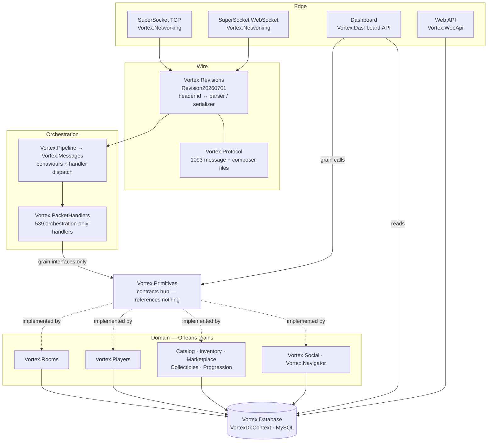

# System overview

## Purpose

What Vortex Cloud is, what runs where, and how a request crosses the system. Read this before any
other page.

## What it is

A Habbo Hotel server emulator: one .NET 10 process that terminates game client connections, speaks
the Habbo binary protocol, holds the live hotel in Orleans grains, persists to MySQL through EF Core,
and hosts two HTTP surfaces (an operator dashboard and a client-facing web API) inside the same
process.

The deployment thesis is **one silo, one process**. That is not an accident of configuration — it is
enforced at startup and inventoried as debt.

## The five listeners

One process, five things that accept traffic, and **three separate DI containers** among them.

| Listener | Port (prod / dev) | Host object | Container |
|---|---|---|---|
| Game TCP | 30000 / 40000 | SuperSocket `IHost` | its own |
| Game WebSocket | 30001 / 40001 | SuperSocket `IHost` | its own |
| Orleans silo | 11111 (gateway 3000) | the generic host | the root container |
| Web API (`/health`, `/metrics`) | 8080 | `WebApplication` | its own |
| Operator dashboard | 9000 | `WebApplication` | its own |

Evidence: `Vortex.Networking/NetworkManager.cs` — `CreateTcpSocket`, `CreateWsSocket`;
`Vortex.Main/Extensions/HostApplicationBuilderExtensions.cs` — `AddOrleans`;
`Vortex.WebApi/Hosting/WebApiWebHost.cs`; `Vortex.Dashboard.API/Hosting/DashboardWebHost.cs` —
`WebApplication.CreateSlimBuilder`. Ports: `appsettings.json`, `appsettings.Development.json`,
`Dockerfile` (`EXPOSE 30000 30001 8080 9000`).

The container split has two practical consequences that bite regularly, both documented on
[Hosting](../01-runtime/hosting.md): the SuperSocket hosts read **unprefixed** environment variables
while the main host reads `VORTEX__`-prefixed ones, and the two web hosts must hand-forward every
service they inject.

## Layering



The load-bearing edge is `HND -->|grain interfaces only| HUB`. `Vortex.PacketHandlers` has **no
project reference** to `Vortex.Rooms`, `Vortex.Inventory`, `Vortex.Furniture`, `Vortex.Navigator` or
`Vortex.Database`. It reaches every domain through interfaces declared in `Vortex.Primitives` and
resolved through `GrainFactoryExtensions`. The missing `.csproj` edge is what keeps handlers thin —
not discipline.

Evidence: `Vortex.PacketHandlers/Vortex.PacketHandlers.csproj` (references: Catalog, Crypto, Logging,
Messages, Primitives, Protocol, Players, Progression, Social);
`Vortex.PacketHandlers/Room/Avatar/DanceMessageHandler.cs` — `_grainFactory.GetRoomAvatars(ctx.RoomId)`;
`Vortex.Primitives/Orleans/GrainFactoryExtensions.cs`;
`Vortex.Hosting.Tests/ProjectBoundaryTests.cs` — `PacketHandlers_DoNotReferenceTheDatabaseProject`,
`PacketHandlers_ContainNoDatabaseUsings`.

`Vortex.Primitives` itself has **zero project references** and is referenced by 46 of the 49
projects. `Vortex.Protocol` was split out of it so wire churn cannot reach the hub, and a build wall
holds that split at exactly zero violations.

Evidence: `Vortex.Primitives/Vortex.Primitives.csproj`;
`scripts/hooks/check-architecture-walls.mjs`; `scripts/hooks/architecture-walls-baseline.json`
(`"protocolLeak": []`).

## The two request paths

### A game packet

```
socket bytes
  → ClientPacketDecoder            length-prefixed frame, RC4 per frame
  → revision.Parsers[headerId]     int → IParser        (Vortex.Revisions)
  → typed IMessageEvent            (Vortex.Protocol)
  → EnvelopeHost                   Type → behaviours + handler bucket
  → IMessageHandler<T>             orchestration only   (Vortex.PacketHandlers)
  → grain call                     the authoritative mutation
  → IComposer
  → revision.Serializers[Type]     Type → ISerializer
  → socket bytes
```

Three lookups, three different key types — an `int` inbound, a `Type` for dispatch, a `Type`
outbound. Full trace: [Packet round trip](../flows/packet-roundtrip.md).

### An admin action

The dashboard does **not** shortcut to the database for anything a grain owns. A `SaveChangesAsync`
inside `Vortex.Dashboard.API` fails the build. Admin writes route through an `I<Domain>AdminService`
into the owning grain, so live state and the row change together.

Evidence: `scripts/hooks/check-architecture-walls.mjs` (Wall 2). Detail:
[Dashboard operations](../08-dashboard/operations.md).

## Where state lives

The single most consequential fact about this codebase:

> **No grain uses `[PersistentState]`.** Every grain persists through EF Core. The only Orleans grain
> storage configured is `PubSubStore`, and it exists because the stream providers require it.

Evidence: repo-wide, `[PersistentState` appears twice, both inside comments
(`Vortex.Main/Configuration/OrleansHostConfig.cs`,
`Vortex.Main/Extensions/HostApplicationBuilderExtensions.cs` — the latter says outright that
`PLAYER_STORE`/`ROOM_STORE` "were never wired to a `[PersistentState]` grain").
`Vortex.Primitives/Orleans/OrleansStateNames.cs` has no consumers and is dead code.

That does not make MySQL the live source of truth. Grains hold live state that the DB lags or never
sees at all, and the coherence rule differs per grain. Three shapes exist:

| Shape | Meaning | Example |
|---|---|---|
| **Serialization point** | grain owns no state; opens a short-lived `DbContext` per call | `GroupGrain`, `CatalogPurchaseGrain` |
| **Hydrate + write-through** | live cache authoritative while active, written per mutation | `PlayerGrain`, `PlayerWalletGrain`, `ServerConfigGrain` |
| **Queue + timer flush** | memory-first, batched to DB on a timer, drained on deactivate | `RoomPersistenceGrain`, `PlayerAchievementGrain` |

A raw SQL edit against data in the second or third shape is silently lost while the grain is active.
The full table is [State ownership](../03-orleans/persistence.md).

## The size of it

| | Count |
|---|---|
| Projects in `Vortex.Cloud.sln` | 49 (4 executables, 14 test, the rest libraries) |
| Grain interfaces / implementations | 62 / 48 |
| Packet handlers (`IMessageHandler<T>`) | 539 |
| Revision parser classes / mapped | 540 / 534 |
| Revision serializer classes / mapped | 556 / **452** |
| Header id constants | 1074 |
| EF entities / migration files | 145 / 131 |
| Test projects / facts | 14 / ~1958 |
| Room-object logic keys | 238 across 199 classes (169 of them wired) |

Sources: [generated indexes](../generated/). The serializer gap is not a rounding error — see
[Revisions](../02-network-protocol/revisions.md).

## What is enforced, and by what

The compiler and the test suite miss whole classes of bug here. Six architecture walls, a header
registry check, a wire-conflict check and a dashboard-parity check exist because each of those
classes shipped at least once.

→ [Architecture boundaries](architecture-boundaries.md) · [Testing](../10-operations/testing.md)

## Known unknowns

- **Unknown:** whether per-session packet processing is serial or concurrent.
  - Inspected: the repo never calls `UsePackageHandlingScheduler<>` (zero hits), so SuperSocket
    2.1.0's default applies; its XML docs ship both a serial and a concurrent scheduler.
  - Why unresolved: settling it means decompiling `SuperSocketService<T>.HandleSession`.
  - Design evidence for *serial*: `Vortex.Networking/Ws/WsPackageHandler.cs` mutates the shared,
    unsynchronised `ctx.WsBuffer` with no lock, which is only correct under serial handling.
  - What would resolve it: decompiling the framework registration, or an instrumented concurrent
    send test.

## Sources

- `Vortex.Main/Program.cs`, `Vortex.Main/VortexEmulator.cs`
- `Vortex.Networking/NetworkManager.cs`, `Vortex.Networking/Package/PackageHandler.cs`
- `Vortex.Primitives/Vortex.Primitives.csproj`, `Vortex.Primitives/Orleans/GrainFactoryExtensions.cs`
- `Vortex.PacketHandlers/Vortex.PacketHandlers.csproj`, `Vortex.PacketHandlers/PacketHandlersModule.cs`
- `Vortex.Main/Extensions/HostApplicationBuilderExtensions.cs` — `AddOrleans`
- `scripts/hooks/check-architecture-walls.mjs`, `scripts/hooks/architecture-walls-baseline.json`
- `Vortex.Hosting.Tests/ProjectBoundaryTests.cs`
- `Dockerfile`, `appsettings.json`, `appsettings.Development.json`
