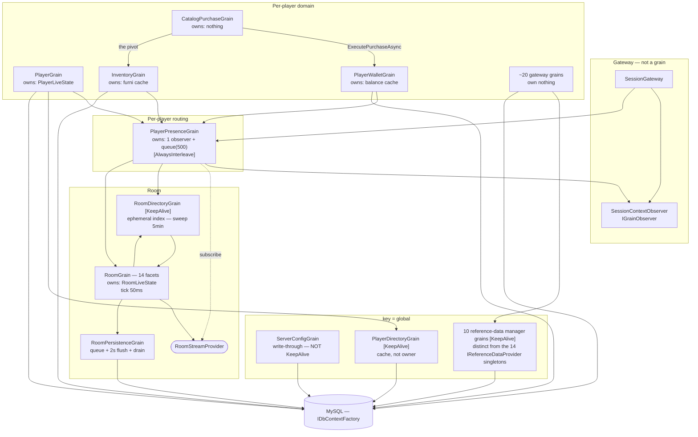

# Grain map

## Purpose

Every grain: what it is keyed by, what it owns, and whether it owns anything at all. Read
[State ownership](persistence.md) alongside this — a grain named after an entity frequently does not
own it.

## Counts

**62 grain interfaces** (47 stand-alone + the `IRoomGrain` aggregate + 14 room facets) implemented by
**48 classes**. 16 string-keyed (15 singletons on `SingletonGrainId.GLOBAL`, plus `VoucherGrain` keyed
by code), 32 integer-keyed.

Machine-readable list: [Grain index](../generated/grain-index.md).

## Reading the table

`K` — `I` = integer key, `S:global` = the `"global"` singleton, `S:code` = a real string key.
**Persistence is `none` for every row, without exception** — see [Orleans overview](overview.md).

## Room

`RoomGrain` is one class implementing 15 grain interfaces. All 14 facets resolve to the **same
activation** for a given room id, so taking a narrow facet costs nothing and documents intent.

| Interface | K | Responsibility | Live state |
|---|---|---|---|
| `IRoomGrain` (aggregate of the 14 below) | I | the whole room | `RoomLiveState` (heavy) |
| `IRoomCore` | I | activation, snapshots, event and composer fan-out | — |
| `IRoomAvatars` | I | avatar lifecycle, movement, posture, chat, carry items, respect | — |
| `IRoomMap` | I | tiles, pathing queries, tile clicks | — |
| `IRoomFurni` (5 partials) | I | floor / wall / edit / interactive furniture | — |
| `IRoomPets` | I | pets in room | — |
| `IRoomBots` | I | bots in room | — |
| `IRoomSecurity` | I | controller level, guild-derived rights refresh | — |
| `IRoomSettings` | I | settings, rights CRUD, tags, rating, deletion | — |
| `IRoomModeration` | I | in-room kick / mute / ban | — |
| `IRoomTrading` | I | the trade session state machine | — |
| `IRoomMysteryBox` | I | box pairing sessions | — |
| `IRoomDoorbell` | I | rings, who may answer, timeouts | — |
| `IRoomCrackable` | I | prize-giving furni | — |
| `IRoomWired` (7 partials) | I | wired **menus** only — variables, chests, logs, stats. Its doc says the wired *engine* is deliberately not exposed here | — |
| `IRoomPersistenceGrain` | I | the furniture write queue for one room | `_dirtyItems`, `_removedItemIds` |
| `IRoomDirectoryGrain` `[KeepAlive]` | S:global | active-room index, populations, lifecycle sweep | 3 dictionaries, **ephemeral** |
| `IModerationQueueGrain` `[KeepAlive]` | S:global | CFH queue serialization and mod fan-out | subscribers, inspected rooms |

Timers: `RoomGrain` 50 ms, `RoomPersistenceGrain` 2000 ms, `RoomDirectoryGrain` 300 000 ms.

> **`RoomGrain.Facets.cs` lists 13 facets, not 14 — `IRoomBots` is missing.** It compiles, because
> `IRoomGrain` supplies it. But that file's own doc says it exists to state "in one view" the complete
> facet set, and it is one short.

`RoomGrain.Capabilities.cs` additionally implements 8 **non-grain** interfaces (`IRoomLookup`,
`IRoomMapAccess`, `IRoomGameAccess`, `IRoomFreezeAccess`, `IRoomChestAccess`,
`IRoomTransactionAccess`, `IRoomBanzaiAccess`, `IRoomFurniAccess`) as explicit implementations. None
derives from a grain interface, so Orleans generates no proxy — these are the in-turn capabilities
handed to furniture logic.

## Player

| Interface | K | Responsibility | Live state |
|---|---|---|---|
| `IPlayerGrain` (5 partials) | I | identity, respect, club/kickback, sanctions, profile | `PlayerLiveState` |
| `IPlayerPresenceGrain` (4 partials) | I | **routing only** — session observer, outbound queue, active-room pointer, stream subscription | a 4-field pointer + `Queue<IComposer>` |
| `IPlayerWalletGrain` | I | debit / grant / refund, commerce receipts | balance cache (DB authoritative) |
| `IPlayerDirectoryGrain` `[KeepAlive]` | S:global | id ↔ name, case-insensitive; search | 2 dictionaries — a **cache, not an owner** |
| `IServerConfigGrain` | S:global | runtime KV config, write-through, MOTD | full row cache. **Not `[KeepAlive]`** |
| `IPlayerNavigatorGrain` | I | navigator prefs, saved searches, home room | 5 fields |
| `IPlayerEffectGrain` | I | avatar-effect inventory, activation, expiry | a timer handle only |
| `IPlayerClothingGrain` | I | redeemed figure sets | none |
| `IPlayerMysteryBoxGrain` | I | box/key ownership, toolbar tracker | none |
| `IMysteryBoxManagerGrain` `[KeepAlive]` | S:global | box definition cache | definitions |
| `IRentableSpaceGrain` | **furniture id** | rent / cancel / expiry for one placed item | 5 fields + expiry timer |

`PlayerPresenceGrain` is the one most often misread. It owns **no player data** —
`PlayerPresenceState` is `ActiveRoomId`, `PendingRoomId`, `PendingRoomApproved`,
`ActiveRoomSinceUtc`. → [Presence routing](presence-routing.md)

## Economy

| Interface | K | Responsibility | Live state |
|---|---|---|---|
| `IInventoryGrain` (5 partials) | I | furni / bot / pet / badge grants, trading moves | `InventoryLiveState` — **furni only** |
| `ICatalogPurchaseGrain` (3 partials) | I | catalog purchase, gifting, room ads | **none** |
| `ILtdRaffleGrain` | LTD series id | raffle window, draw, serial claim, refunds | batch + series; one-shot draw timer |
| `IVoucherGrain` | S:code — `code.Trim().ToUpperInvariant()` | create / redeem, serialized per code | the voucher |
| `IPlayerTargetedOfferGrain` | I | which offer this player sees, purchase, tracking | none |
| `ITargetedOfferManagerGrain` `[KeepAlive]` | S:global | offer definition cache | definitions |
| `IMarketplacePurchaseGrain` | I | list / buy / cancel / redeem | none |
| `IMarketplaceSearchGrain` | S:global | marketplace queries | none |

`InventoryGrain` caches **furniture only**. Bots, pets and badges are queried per call.

## Social

| Interface | K | Responsibility | Live state |
|---|---|---|---|
| `IMessengerGrain` (4 partials) | I | friends, requests, blocks, IMs, presence fan-out | 6 collections; delivered-flag flush timer |
| `IGroupGrain` (5 partials) | I | guild identity, membership, ranks | **none** — its own doc calls it "a serialization point per guild rather than a cache" |
| `IGroupDirectoryGrain` `[KeepAlive]` | S:global | guild creation, my-groups | none |
| `IGroupForumGrain` | I | forum threads, posts, moderation | none |
| `IGuideDirectoryGrain` `[KeepAlive]` | S:global | on-duty roster, help sessions, chat reviews | 6 dictionaries, **ephemeral by design** — its doc says persisting on-duty status would be wrong, it must not survive a restart. 5 s sweep timer |
| `IPlayerQuizGrain` | I | help quizzes, server-side grading | none |

## Progression

| Interface | K | Responsibility | Live state |
|---|---|---|---|
| `IPlayerAchievementGrain` | I | progression, level-ups, rewards | dirty progress map + flush timer |
| `IAchievementManagerGrain` `[KeepAlive]` | S:global | achievement definition cache | definitions |
| `IPlayerAchievementResolutionGrain` | I | resolution statues and challenges | none |
| `IPlayerBadgeGrain` | I | badge inventory gateway | none |
| `IQuestManagerGrain` `[KeepAlive]` | S:global | quest definition cache | definitions |
| `IPlayerQuestGrain` | I | quest progress | none |
| `IPlayerDailyTaskGrain` | I | daily task board and rewards | none |
| `ICommunityGoalGrain` `[KeepAlive]` | S:global | hotel-wide goal | `_totalScore` — a genuine cluster-wide running total |
| `IPollManagerGrain` `[KeepAlive]` | S:global | survey tree cache | definitions |
| `IPlayerPollGrain` | I | per-player survey state | none |
| `IPrizePoolManagerGrain` `[KeepAlive]` | S:global | weighted prize pool cache | 2 fields |
| `IPlayerPrizeGrain` | I | prize granting and audit | none |

`PlayerAchievementGrain` splits by stakes, documented in its class doc: a **level-up writes through
immediately** and grants nothing until the write lands; plain progress is marked dirty and batched.

## Collectibles

| Interface | K | Responsibility | Live state |
|---|---|---|---|
| `INftCollectionsGrain` `[KeepAlive]` | S:global | collection definitions (ownership **not** cached) | collections |
| `INftStoreGrain` `[KeepAlive]` | S:global | Collectors Guild shop; the limited-count decision point | offers |
| `INftMintingGrain` `[KeepAlive]` | S:global | mintable types and stamp offers | 2 arrays |
| `IPlayerMintGrain` | I | stamps, conversions | none |
| `IPlayerNftClaimsGrain` | I | Relic claims (double-click safe) | none |
| `IPlayerNftWardrobeGrain` | I | whole-avatar wardrobe | none |
| `IPlayerVaultGrain` | I | vault income rewards | `_pendingRewards` |

> `IPlayerVaultGrain` and `IPlayerNftWardrobeGrain` are declared in `Vortex.Primitives/Players/Grains/`
> but implemented in `Vortex.Collectibles` — the only two whose interface namespace does not match
> their implementation module.

See also the caveat about `Vortex.Collectibles` having no DI module on
[Solution map](../00-overview/solution-map.md).

## Grains that own nothing

Roughly 20 per-player grains open a short-lived `DbContext` per call and hold no fields:
`GroupGrain`, `GroupDirectoryGrain`, `GroupForumGrain`, `CatalogPurchaseGrain`,
`PlayerTargetedOfferGrain`, `MarketplacePurchaseGrain`, `MarketplaceSearchGrain`, `PlayerBadgeGrain`,
`PlayerPrizeGrain`, `PlayerQuestGrain`, `PlayerDailyTaskGrain`, `PlayerPollGrain`, `PlayerQuizGrain`,
`PlayerAchievementResolutionGrain`, `PlayerClothingGrain`, `PlayerMysteryBoxGrain`, `PlayerMintGrain`,
`PlayerNftClaimsGrain`, `PlayerNftWardrobeGrain`, `PlayerEffectGrain`.

They exist for **per-key serialization**, not for caching. That is a legitimate and common reason to
be a grain here.

## Ownership traps

Four worth naming explicitly:

1. **`InventoryGrain` does not own furniture ownership.** `furniture.player_id` is written by
   `RoomPersistenceGrain`, by `InventoryGrain`'s own partials, by `MarketplacePurchaseGrain`, and by
   `WiredTradeSettlement` — four writers on one column. The inventory cache resyncs via `ReloadAsync`.
   And `IInventoryGrain.Add/RemoveFurnitureAsync` are **view-only**:
   [Inventory ownership](../06-economy/inventory.md).
2. **`PlayerGrain` does not own the wallet.** Currencies belong to `PlayerWalletGrain`.
3. **`PlayerDirectoryGrain` is a read-through cache, not an owner.** `PlayerGrain.SetNameAsync` does
   the DB write, *then* notifies the directory. `SetNameCache` removes the stale reverse entry before
   inserting, which is the forward/reverse coherence rule.
4. **`RoomGrain` owns rights live, and the DB row is written in the same method** — that pairing is
   the fix for a real shipped bug. → [Persistence](persistence.md)

## Ownership diagram

Solid = grain call. Dotted = stream subscription. `DB` edges are a `DbContext` opened per call.

## Sources

- `Vortex.Primitives/Rooms/Grains/IRoomGrain.cs` and the 14 facet files
- `Vortex.Primitives/Orleans/GrainFactoryExtensions.cs`
- `Vortex.Rooms/Grains/{RoomGrain,RoomGrain.Facets,RoomGrain.Capabilities,RoomDirectoryGrain,RoomPersistenceGrain,RoomLiveState}.cs`
- `Vortex.Players/Grains/{PlayerGrain,PlayerPresenceGrain,PlayerWalletGrain,PlayerDirectoryGrain,ServerConfigGrain}.cs`
- `Vortex.Inventory/Grains/InventoryGrain.cs` + partials
- `Vortex.Catalog/Grains/{CatalogPurchaseGrain,LtdRaffleGrain,VoucherGrain}.cs`
- `Vortex.Social/Grains/{MessengerGrain,GroupGrain,GuideDirectoryGrain}.cs`
- `Vortex.Progression/Grains/PlayerAchievementGrain.cs`
- `Vortex.Collectibles/Grains/*.cs`
- [Grain index](../generated/grain-index.md)
