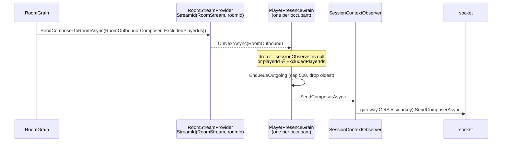

# Presence and composer routing

## Purpose

How a composer reaches a player's screen, which of the three paths to use, and the two things about
`PlayerPresenceGrain` that are not what the contract says.

## The three outbound paths

| Target | Path | Used by |
|---|---|---|
| **the session that sent this packet** | `ctx.SendComposerAsync` → `ISessionContext` → socket | 306 sites in 222 handler files |
| **any other player** | `IPlayerPresenceGrain.SendComposerAsync` → observer → gateway → socket | 38 handler files, and every grain |
| **everyone in a room** | `RoomGrain.SendComposerToRoomAsync` → Orleans memory stream → each occupant's presence grain | rooms |

The first is a direct socket write, and it is normal. `MessageContext` is the request's own reply
channel — not a raw socket handle a handler dug up. The written rule in `AGENTS.md` does not draw
this distinction, which is the one standing contract conflict in this area:
[Architecture boundaries](../00-overview/architecture-boundaries.md).

## PlayerPresenceGrain

Keyed by player id. `Vortex.Players/Grains/PlayerPresenceGrain.cs` plus four partials
(`.Room`, `.Wallet`, `.Avatar`, `.Inventory`).

**It owns no player data.** `PlayerPresenceState` is four fields: `ActiveRoomId`, `PendingRoomId`,
`PendingRoomApproved`, `ActiveRoomSinceUtc`. The name is about *routing*, not about the player —
profile lives on `PlayerGrain`, money on `PlayerWalletGrain`.

What it does own: one session observer and one outbound queue.

### One session per player — not a fan-out

```csharp
private ISessionContextObserver? _sessionObserver;      // a single field

public Task RegisterSessionObserverAsync(ISessionContextObserver observer)
{
    _sessionObserver = observer;                        // a bare assignment
    return Task.CompletedTask;
}
```

`SessionGateway._playerToSession` is 1:1, and `AddSessionToPlayerAsync` **closes the previous
session's transport** before rebinding.

> **`CONTEXT.md`'s "fan-out to subscribed sessions" describes a design that is not built.** There is
> exactly one subscriber, always. A second login kicks the first.

### The outbound queue

```csharp
[AlwaysInterleave] Task SendComposerAsync(IComposer composer);   // on the interface, both overloads
```

`[AlwaysInterleave]` carries an explicit deadlock rationale in its XML doc: a room pushing a composer
at a player from inside a call that player's own presence grain made would otherwise wedge until the
30 s Orleans timeout.

The path:

1. `EnqueueOutgoing` appends to `Queue<IComposer> _outgoingQueue`.
2. Past `PlayerPresenceConfig.MaxOutgoingQueueSize` (default **500**) it **drops the oldest** and logs
   a warning. This is the "bound session collections" rule, honoured.
3. `LogAndForget(ProcessOutgoingQueueAsync())` — fire-and-forget with a logged faulted continuation.
4. `ProcessOutgoingQueueAsync` guards on `_isProcessingQueue`, does `await Task.Yield()`, and drains
   **only if `_sessionObserver is not null`**.
5. `_sessionObserver.SendComposerAsync(payload)` → Orleans object reference →
   `SessionContextObserver` → `_sessionGateway.GetSession(key)` → encode → socket.

### Offline behaviour

If the grain is active with no observer attached, composers accumulate and are discarded oldest-first
at 500. Bounded — not a leak.

But `RegisterSessionObserverAsync` **does not** call `ProcessOutgoingQueueAsync`. A backlog queued
while detached waits for the *next* `SendComposerAsync` to flush it. Delivery is opportunistic.

## The socket handle

The link back to a socket is an **Orleans object reference**, minted by the gateway, not a grain:

```csharp
// SessionGateway.AddSessionAsync
var observer = _grainFactory.CreateObjectReference<ISessionContextObserver>(
    new SessionContextObserver(key, this));
```

`SessionContextObserver.SendComposerAsync` re-resolves the session from the gateway on **every**
call — a late-binding handle, never a captured socket. Released with `DeleteObjectReference` on
disconnect.

That indirection is what lets a room grain push to a player without knowing anything about
connections.

## Room fan-out



`ExcludedPlayerIds` is how "everyone but the actor" is expressed. Subscription happens in
`SetActiveRoomAsync`; unsubscription in `ClearActiveRoomAsync` and `OnDeactivateAsync`.

**A room never writes to a socket.** It publishes to a stream. That is what lets a room grain
deactivate, relocate, or be tested without a network stack.

## Room entry and exit, from the presence side

`PlayerPresenceGrain.Room.cs`:

**`SetActiveRoomAsync`** — clear the previous room → set `ActiveRoomId`, clear pending →
`RoomDirectoryGrain.AddPlayerToRoomAsync` → subscribe to the room stream → fetch
`PlayerSummarySnapshot` → `IRoomAvatars.CreateAvatarFromPlayerAsync` → publish `PlayerEnteredRoomEvent`.

**`ClearActiveRoomAsync`** — deliberately best-effort:

```csharp
try { await roomAvatars.RemoveAvatarFromPlayerAsync(…); }
catch (Exception ex) { _logger.LogWarning(ex, …); }   // the player must stop being an occupant
                                                       // even if the room call fails
await directory.RemovePlayerFromRoomAsync(…, CancellationToken.None);
```

The comment names the bug it prevents: a ghost occupant blocks re-entry and shows in the navigator
forever. `CancellationToken.None` is deliberate for the same reason.

**`UnregisterSessionObserverAsync`** calls `ClearActiveRoomAsync` **first**, then nulls the observer.
`OnDeactivateAsync` clears the queue, unregisters, and unsubscribes the stream, each in its own
try/catch with a logged warning.

## Grains own their own outbound

When grain state changes, the grain sends the composer. The caller does not.

```
correct:  handler → wallet.GrantCreditsAsync(…)
                    └─ grain updates state
                    └─ grain → PlayerPresenceGrain.OnCurrencyUpdateAsync
                                 └─ CreditBalanceEventMessageComposer
```

`PlayerPresenceGrain.Wallet.cs` turns a currency update into the right composer per kind
(`CreditBalanceEventMessageComposer`, `EmeraldBalanceMessageComposer`, `SilverBalanceMessageComposer`,
`HabboActivityPointNotificationMessageComposer`).

## Configuration

| Key | Consumer | Default |
|---|---|---|
| `Vortex:PlayerPresence:MaxOutgoingQueueSize` | `EnqueueOutgoing` | 500, oldest dropped |
| `Vortex:PlayerPresence:FurniInventoryFragmentSize` | `.Inventory` partial | 100 |

## Known unknowns

- **Unknown:** whether the never-drain-on-reattach behaviour is intended.
  - Inspected: `RegisterSessionObserverAsync`, `ProcessOutgoingQueueAsync`, all callers.
  - Plausible intent: a reconnecting client re-requests everything anyway, so replaying a stale
    backlog would be wrong.
  - What would resolve it: a comment, or a reconnect test asserting either behaviour.
- **Latent, not observed:** `_isProcessingQueue` has no `finally`. `ProcessOutgoingQueueAsync` sets it
  true, awaits `_sessionObserver.SendComposerAsync` in a loop, and sets it false at the end. If that
  await throws — an Orleans observer call can, on timeout — the flag stays `true` for the grain's
  lifetime and the queue never drains again: the player goes mute while still appearing online. Both
  session implementations swallow their own exceptions, so this is latent rather than observed. The
  code shape is real; the failure has not been seen.

## Sources

- `Vortex.Players/Grains/PlayerPresenceGrain.cs` + `.Room.cs`, `.Wallet.cs`, `.Avatar.cs`, `.Inventory.cs`
- `Vortex.Players/Grains/PlayerPresenceState.cs`
- `Vortex.Players/Configuration/PlayerPresenceConfig.cs`
- `Vortex.Primitives/Players/Grains/IPlayerPresenceGrain.cs` — the `[AlwaysInterleave]` rationale
- `Vortex.Primitives/Orleans/Observers/ISessionContextObserver.cs`
- `Vortex.Networking/Session/SessionGateway.cs`, `SessionContextObserver.cs`
- `Vortex.Rooms/Grains/RoomGrain.cs` — `SendComposerToRoomAsync`, `OnActivateAsync` stream binding
- `Vortex.Logging/Extensions/TaskLoggingExtensions.cs` — `LogAndForget`
