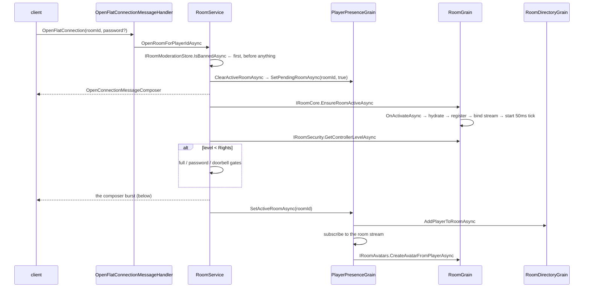

# Room lifecycle

## Purpose

Entering and leaving a room, step by step, with the exact composer burst the client receives.

## Enter



### 1–4 · Request and gates

`OpenFlatConnectionMessageHandler.HandleAsync` calls
`IRoomService.OpenRoomForPlayerIdAsync(ctx.AsActionContext(), ctx.PlayerId, roomId, ct, password)` and
nothing else.

`RoomService.OpenRoomForPlayerIdAsync`:

1. **Ban check first, before anything else.** `IRoomModerationStore.IsBannedAsync` queries `room_bans`
   for `DeletedAt == null && DateExpires > now`; a hit sends `CantConnectMessageComposer{Banned}` and
   returns.
2. **Re-entry short-circuit** — `if (pendingRoom.RoomId == roomId) return;`
3. `ClearActiveRoomAsync` then `SetPendingRoomAsync(roomId, true)`.
4. `OpenConnectionMessageComposer{RoomId}` is sent, then `IRoomCore.EnsureRoomActiveAsync(ct)`.

### 5 · Activation and hydration

`RoomGrain.OnActivateAsync` seeds the six tick clocks off `NowMs()`, runs `HydrateRoomStateAsync` and
`HydrateModerationStateAsync`, registers with `RoomDirectoryGrain.UpsertActiveRoomAsync`, binds the
outbound stream, and starts the tick timer.

`HydrateRoomStateAsync` does **one** `AsNoTracking` read of `rooms` with
`.Include(GroupEntity).Include(PlayerEntity)`, resolves the model, builds the `RoomSnapshot`, seeds
`RoomProperties` (wallpaper / floor / landscape default to `"0"`), loads `room_rights` into
`PlayerIdsWithRights`, and calls `HydrateGroupMembershipAsync` for guild ranks.

`EnsureRoomActiveAsync` then lazily builds what activation did not:
`MapModule.EnsureMapBuiltAsync` (allocates the six tile arrays from the model),
`FurniModule.EnsureFurniLoadedAsync` (**floor items with tile computation paused**, then one
`ComputeAllTiles()`, then wall items), `PetSystem.EnsurePetsLoadedAsync`.

### 6 · Authorization

`RoomSecurityModule.GetControllerLevelAsync` → `RoomSecurityPolicy.ResolveControllerLevel`.
→ [Room architecture](room-architecture.md)

### 7 · Door gates — only below `Rights`

| Condition | Outcome |
|---|---|
| `PlayersMax > 0 && avatars >= PlayersMax` | `CantConnect{RoomFull}`, pending cleared |
| `DoorMode.Password` and mismatch | `CantConnect{NoEntry}`, pending cleared |
| `DoorMode.Locked` | `IRoomDoorbell.RegisterDoorbellRingAsync` and **return** — pending stays set |

A locked door is resolved either by `RoomService.Doorbell.cs.AnswerDoorbellAsync` (which re-checks
`>= Rights` on the *answerer* and calls `CompleteRoomEntryAsync`) or by the tick sweep
`RoomGrain.ProcessDoorbellTimeoutsAsync` after `DoorbellTimeoutMs` (20 000 ms).

### 8 · The composer burst

`RoomService.CompleteRoomEntryAsync`, in exactly this order:

```
batch 1   RoomReadyMessageComposer
          RoomRatingMessageComposer
          RoomEntryTileMessageComposer
          HeightMapMessageComposer
          FloorHeightMapMessageComposer
          RoomVisualizationSettingsMessageComposer

then      RoomPropertyMessageComposer  × one per RoomProperties entry
                                         (wallpaper, floor, landscape, landscapeanim)

batch 2   RoomEntryInfoMessageComposer
          ObjectsMessageComposer        (floor items + owner names)
          ItemsMessageComposer          (wall items)
          UsersMessageComposer
          UserUpdateMessageComposer
          YouAreControllerMessageComposer
          WiredPermissionsEventMessageComposer{CanModify = CanRead = level >= Rights}

if owner  YouAreOwnerMessageComposer
then      DanceMessageComposer × one per dancing occupant

finally   playerPresence.SetActiveRoomAsync(roomId, ct)
```

### 9 · Membership and the avatar

`PlayerPresenceGrain.SetActiveRoomAsync` clears any previous room, sets `ActiveRoomId`, calls
`RoomDirectoryGrain.AddPlayerToRoomAsync`, **subscribes as `IAsyncObserver<RoomOutbound>`** to the
room stream, fetches `PlayerSummarySnapshot`, then `IRoomAvatars.CreateAvatarFromPlayerAsync`, then
publishes `PlayerEnteredRoomEvent`.

`RoomAvatarModule.CreateAvatarFromPlayerAsync` assigns an object id from a per-room counter, spawns at
`Model.DoorX/DoorY/DoorRotation` — falling back to `MapModule.FindFallbackSpawnTile()` with a warning
when the model's door is out of bounds — stamps `AvatarStatusType.FlatControl` with the resolved
controller level, attaches the object (which broadcasts `UsersMessageComposer`), seeds
`HotelMuteExpiresUtc` from the player snapshot, and calls `GameSystem.OnPlayerEnteredAsync`.

The grain wrapper then restores the worn effect via `IPlayerEffectGrain.GetSelectedEffectAsync`
(broadcasting `AvatarEffectMessageComposer`) and publishes `PlayerEnterEvent` — which is what feeds the
wired `wf_trg_enter_room` trigger.

## The second entry path

`GetRoomEntryDataMessageHandler` re-sends `Objects` / `Items` / `Users` / `UserUpdate` /
`YouAreController` / `WiredPermissions` (plus `YouAreOwner`, dances, **effects** and **hand items**)
and calls `SetActiveRoomAsync`. It reads `GetPendingRoomAsync()` and returns when the pending id is
`<= 0`, so it only does work while pending is still set.

> **The two paths are not identical.** `CompleteRoomEntryAsync` replays dances only;
> `GetRoomEntryDataMessageHandler` also replays `AvatarEffectMessageComposer` and
> `CarryObjectMessageComposer`. Whether that asymmetry is intentional is not documented anywhere.

## Leave

| Trigger | Path |
|---|---|
| Explicit quit | `QuitMessageHandler` → `RoomService.CloseRoomForPlayerAsync` — cancels any pending doorbell ring, clears pending, `ClearActiveRoomAsync`, sends `CloseConnectionMessageComposer` |
| Disconnect | `PlayerPresenceGrain.UnregisterSessionObserverAsync` → `ClearActiveRoomAsync` **first**, then nulls the observer |
| Deactivation | `PlayerPresenceGrain.OnDeactivateAsync` → `ClearActiveRoomAsync` |

`ClearActiveRoomAsync` is deliberately best-effort — the room call is wrapped in try/catch so the
player stops being an occupant even if the room grain fails, and `RemovePlayerFromRoomAsync` runs with
`CancellationToken.None`. The comment names the bug: a ghost occupant blocks re-entry and lingers in
the navigator.

Room side — `RoomGrain.RemoveAvatarFromPlayerAsync`: close the trade, cancel mystery-box sessions and
chest screens for the leaver, `AvatarModule.RemoveAvatarFromPlayerAsync` → `RemoveObjectAsync` (stop
walk, remove from map, `Logic.OnDetachAsync`, broadcast `UserRemoveMessageComposer`), drop
`HotelMuteExpiresUtc`, `GameSystem.OnPlayerLeftAsync`, publish `PlayerLeftEvent`.

## Deactivation

`RoomDirectoryGrain.CheckRoomsAsync` calls `DeactivateRoomAsync()` (→ `DeactivateOnIdle()`) on any
room with zero population every 5 minutes.

`RoomGrain.OnDeactivateAsync` runs `FlushDirtyItemsAsync` + `PetSystem.FlushDirtyPetsAsync`, then
`RoomDirectoryGrain.RemoveActiveRoomAsync`, all inside one try/catch that logs a warning.

Everything in `RoomLiveState` that was not flushed is gone — including all game teams and scores.
`RoomGameSystem`'s doc says that is the point: *"a game naturally dies with the room, matching
Habbo."*

## Known unknowns

- **Unknown:** whether the entry-path asymmetry (effects and hand items replayed on one path only) is
  intentional. Inspected both methods and their callers; nothing documents it.

## Sources

- `Vortex.PacketHandlers/Room/Session/{OpenFlatConnectionMessageHandler,QuitMessageHandler}.cs`
- `Vortex.PacketHandlers/Room/Engine/GetRoomEntryDataMessageHandler.cs`
- `Vortex.Rooms/RoomService.cs`, `RoomService.Doorbell.cs`
- `Vortex.Rooms/RoomModerationStore.cs`
- `Vortex.Rooms/Grains/RoomGrain.cs` — `OnActivateAsync`, `EnsureRoomActiveAsync`, `HydrateRoomStateAsync`, `OnDeactivateAsync`
- `Vortex.Rooms/Grains/RoomGrain.Avatar.cs`, `RoomGrain.Doorbell.cs`
- `Vortex.Rooms/Grains/Modules/RoomAvatarModule.cs`
- `Vortex.Players/Grains/PlayerPresenceGrain.Room.cs`
- `Vortex.Rooms/Grains/RoomDirectoryGrain.cs`
