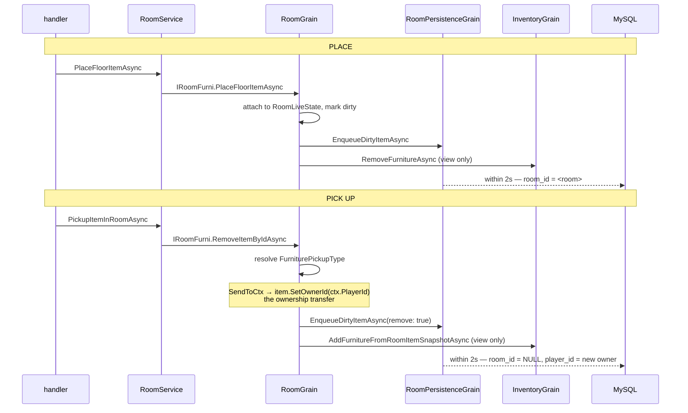

# Inventory and item ownership

## Purpose

The single most misread contract in this codebase.

## The trap

> **`IInventoryGrain.AddFurnitureAsync` and `RemoveFurnitureAsync` are view-only.** They mutate an
> in-memory dictionary and notify the client. They write **nothing** to the database.

```csharp
// Vortex.Inventory/Grains/Modules/InventoryFurniModule.cs
public Task<bool> RemoveFurnitureAsync(RoomObjectId itemId, CancellationToken ct)
{
    if (!_state.FurnitureById.Remove(itemId, out IFurnitureItem? item))
        return Task.FromResult(false);

    return Task.FromResult(true);
}
```

`InventoryGrain.RemoveFurnitureAsync` wraps that with a snapshot read, a
`presence.OnFurnitureRemovedAsync` notification and a mystery-box tracker refresh. Still no DB write.

**The durable ownership write is the caller's responsibility.** Most callers do it. One does not —
see [Marketplace](marketplace.md).

## What "in the inventory" means

`Vortex.Inventory/Factories/InventoryFurnitureLoader.cs` — `LoadByPlayerIdAsync`. Four predicates,
and they *are* the definition:

```csharp
.Where(x =>
    x.PlayerEntityId == (int)playerId
    && x.RoomEntityId == null
    // An item sitting in a wired chest is out of its owner's hands until it is
    // withdrawn. Without this it would be listed here as well, and the same row
    // would exist twice on screen: once in the inventory, once in the chest.
    && x.WiredChestEntityId == null
    && x.DeletedAt == null)
```

Note the wired-chest predicate and its comment. That is the shape a "the item is elsewhere" state
must take: **a column plus a predicate**. Any other way of holding an item out of the inventory has to
do the same thing or the row shows up twice.

## The caller checklist

A caller that removes an item from a player's hands must do **both** halves:

| Step | Why |
|---|---|
| 1. write the DB (`DeletedAt`, `RoomEntityId`, `WiredChestEntityId`, or `PlayerEntityId`) | so it survives a reload |
| 2. call `RemoveFurnitureAsync` | so the client hears about it now |

Callers that do it correctly, with the shape to copy:

```csharp
// Vortex.Players/Grains/PlayerClothingGrain.cs — the DB write first…
await dbCtx.Furnitures.Where(f => f.Id == itemId)
    .ExecuteUpdateAsync(s => s.SetProperty(f => f.DeletedAt, now)
                              .SetProperty(f => f.RoomEntityId, (int?)null), ct);
…
// …then the view, "so the client hears about it"
await inventory.RemoveFurnitureAsync(new RoomObjectId(itemId), ct);
```

Same shape in `Vortex.Collectibles/Grains/PlayerMintGrain.cs`.

For placement, `Vortex.Rooms/Grains/Modules/RoomActionModule.Floor.cs` calls
`FurniModule.PlaceFloorItemAsync` — which enqueues the dirty item for `RoomPersistenceGrain` — and
*then* removes it from the inventory view. The durable half is the persistence flush.

## Placement and pickup



Two things worth internalising:

1. **`FurniturePickupType.SendToCtx` reassigns the owner in memory** — `item.SetOwnerId(ctx.PlayerId)`.
   That is the ownership transfer, and it becomes durable only via the 2 s persistence batch.
2. **The window is real.** A crash inside it reverts to the DB state (the item is back where it was) —
   no duplication, but the client has already been told otherwise, and anything reading
   `furniture.room_id` in that window sees the stale value.

Two grains work around that window explicitly: `PlayerMintGrain` and `PlayerClothingGrain` both drop
the `room_id IS NULL` predicate from their queries with a comment naming the batch as the reason.

## Four writers, one column

`furniture.player_id` is written by:

| Writer | When |
|---|---|
| `RoomPersistenceGrain.FlushDirtyItemsAsync` | placement, pickup, moves — marks `PlayerEntityId` and `RoomEntityId` modified |
| `InventoryGrain` partials | grants |
| `MarketplacePurchaseGrain` | delivery of a bought item |
| `WiredTradeSettlement` | a wired contract settling |

The inventory cache resyncs through `InventoryFurniModule.ReloadAsync`, which discards the cache and
re-reads. `ReloadAsync` is called after a trade commit "so the in-memory view re-syncs from the source
of truth".

## What is cached and what is not

`InventoryLiveState` caches **furniture only** (`FurnitureById`, `IsFurnitureReady`, loaded lazily on
first read). Bots, pets and badges are queried per call by their own partials.

## Grants

`InventoryGrain.GrantCatalogOfferAsync` is the pivot of a catalog purchase:

1. resolve guild identity from `extraParam` via `IGroupDirectoryGrain.GetFurniIdentityAsync`
2. `CatalogFulfillmentPlanner.Plan(…)` — **pure**: no DB, no grains, no clock. So a definition or
   product error fails before anything durable happens
3. **one `SaveChangesAsync` commits furniture + badges + pets + bots** (the comment records that this
   used to be four commits)
4. post-pivot: cache update, presence notifications, `ItemCreatedEvent`, badge announcements — each in
   its own `try/catch` that logs and swallows
5. `AnnounceGrantedFamiliesAsync` runs on **`CancellationToken.None`** so a client disconnect cannot
   be read as "undo the sale"

That structure — pure planning, one commit, best-effort afterwards — is the shape to copy.

`GrantSingleFurnitureIfUnderLimitAsync`'s doc states the invariant plainly: *"check-then-create is
atomic because Orleans serializes calls to this grain instance."*

## Known issues

1. **A failed Builders Club placement leaks a row.**
   `Vortex.PacketHandlers/Catalog/BuildersClubPlaceRoomItemMessageHandler.cs` (and its wall
   equivalent) inserts a real `furniture` row via `TryGrantEligibleItemAsync`; if
   `PlaceFloorItemAsync` returns false it calls `RemoveFurnitureAsync`, which only clears the view.
   The row stays and reappears on reload. Low impact — Builders Club items are free — but it is the
   same view-only mistake.
2. **`FurnitureItem` hardcodes `RoomId = -1`.** `Vortex.Inventory/Furniture/FurnitureItem.cs` sets it
   in every snapshot it builds, which makes `MarketplacePurchaseGrain`'s `snapshot.RoomId.Value > 0`
   guard unreachable dead code.

## Configuration

| Key | Consumer | Default |
|---|---|---|
| `Vortex:Inventory:FurniPerFragment` | inventory paging | 100 |
| `Vortex:PlayerPresence:FurniInventoryFragmentSize` | presence fragmenting | 100 |

## Known unknowns

- **Unknown:** whether any reconciliation exists for rows that fall out of both the inventory view and
  a room.
  - Inspected: `FurnitureEntity` (no marketplace or "held" column beyond `WiredChestEntityId`), every
    caller of `RemoveFurnitureAsync`, and every consumer of `MarketplaceOfferListedEvent` (only the
    audit handler). No startup sweep found.
  - Why it matters: see [Marketplace](marketplace.md).
  - What would resolve it: a `SELECT` for rows whose `player_id` owner cannot see them.

## Sources

- `Vortex.Inventory/Grains/Modules/InventoryFurniModule.cs`
- `Vortex.Inventory/Grains/InventoryGrain.cs`, `.Furni.cs`, `.Trading.cs`
- `Vortex.Inventory/Factories/InventoryFurnitureLoader.cs`
- `Vortex.Inventory/Fulfillment/CatalogFulfillmentPlanner.cs`
- `Vortex.Inventory/Furniture/FurnitureItem.cs`
- `Vortex.Rooms/Grains/Modules/RoomActionModule.cs`, `.Floor.cs`
- `Vortex.Rooms/Grains/RoomPersistenceGrain.cs`
- `Vortex.Players/Grains/PlayerClothingGrain.cs`, `Vortex.Collectibles/Grains/PlayerMintGrain.cs`
- `Vortex.Primitives/Inventory/Grains/IInventoryGrain.Furni.cs`
