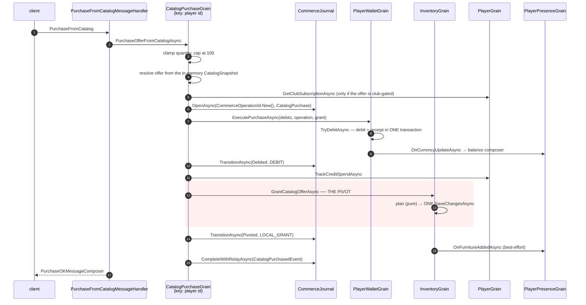

# Flow: catalog purchase

The reference commerce flow, and the template every other value-moving path is measured against.

## Trigger

`PurchaseFromCatalog` — page id, offer id, extra param, quantity.

## The trace



## The pivot

Everything before `GrantCatalogOfferAsync`'s `SaveChangesAsync` is **compensated** — a failure refunds.
Everything after is **retried**, never reversed.

```
open journal → debit → [ PIVOT ] → complete + relay
     │           │                      │
     │           └─ fails → refund on CancellationToken.None, FailedBeforePivot
     └─ the relay sweep is the retry for anything after
```

## Guards, in order

| Guard | Where | Why |
|---|---|---|
| `quantity = Math.Max(1, quantity)`, refuse above **100** | `BundleDiscountRulesetSnapshot.DEFAULT_MAX_PURCHASE_SIZE` — a compile-time constant, no override | unchecked `int` price multiplication wraps negative and drops the debit |
| `Total(unitCost, quantity)` in **`long`**, throws above `int.MaxValue` | `TryGetDebitRequests` | same class of bug, one layer down |
| club level and discount | `ResolveClubPricingAsync` — reads the subscription **only** when `ClubLevel > 0 \|\| DiscountPercent > 0` | avoids a grain call on every purchase |
| balance | `TryDebitAsync` only debits when `currentAmount >= cost`; a mismatch between `ChangedBy` and the request amount throws | the wallet invariant |

`Vortex.Database.Tests/Catalog/CatalogPurchaseTests.cs` —
`ThePriceOfAnUnboundedQuantity_WouldWrapNegative`.

## The debit

`PlayerWalletGrain.TryDebitAsync`:

- `TryNormalizeRequests` coalesces duplicate `CurrencyKind`s and drops non-positive amounts
- a fresh `DbContext` per `IExecutionStrategy` attempt, inside `BeginTransactionAsync`
- **the `CommerceReceiptEntity` is added in the same transaction as the debit**
- a `DbUpdateException` on `(operation_id, step_key)` **is the replay signal**: the cache is rolled
  back via `RollbackUpdatesAsync` and `Success()` is returned **without republishing the event**

A currency the player has no row for reads `changedBy = 0`, fails the invariant, and returns
`InsufficientBalance` — a debit cannot silently succeed on a missing currency.

## The grant — the shape to copy

`InventoryGrain.GrantCatalogOfferAsync`:

1. resolve guild identity from `extraParam` via `IGroupDirectoryGrain.GetFurniIdentityAsync`
2. **`CatalogFulfillmentPlanner.Plan(...)` — pure.** No DB, no grains, no clock. A definition or
   product error therefore fails *before* anything durable happens
3. **one `SaveChangesAsync` commits furniture + badges + pets + bots.** The comment records that this
   used to be four commits
4. post-pivot, each in its own `try/catch` that logs and swallows: cache update, presence
   notifications, `ItemCreatedEvent`, badge announcements
5. `AnnounceGrantedFamiliesAsync` runs on **`CancellationToken.None`** — with a `ponytail:` comment —
   so a client disconnect cannot be read as "undo the sale"

## The composers

| Outcome | Composer |
|---|---|
| success | `PurchaseOKMessageComposer{Offer}` |
| insufficient balance | `NotEnoughBalanceMessageComposer` (with the offending `ActivityPointType`) |
| refused | `PurchaseNotAllowedMessageComposer` |
| balance change | `CreditBalanceEventMessageComposer` / `Emerald…` / `Silver…` / `HabboActivityPointNotification…` |

The balance composer is sent **by the wallet grain**, not by the handler — the grain owns its own
outbound. → [Presence routing](../03-orleans/presence-routing.md)

## Failure matrix

| Fails at | Outcome |
|---|---|
| quantity / price ceiling | `PurchaseFailed`, nothing opened |
| club gate | `RequiresHabboClub` |
| debit | `FailedBeforePivot`, `NotEnoughCredits` / `NotEnoughActivityPoints` |
| **the planner** | throws before the pivot — refunded |
| **the single grant save** | throws → executor refunds on `CancellationToken.None` |
| a post-pivot notification | logged and swallowed. **The player keeps the goods and the charge** — `AnEffectThatFailsLast_KeepsTheGoodsAndTheCharge` |
| the relay publish | logged; the sweep retries |

## Idempotency

The whole operation is replayable because **every durable step co-commits its receipt**:

```
commerce_receipts (operation_id, step_key)  UNIQUE
```

`CommerceJournal.TryRecordStepAsync` deliberately lets the insert **fail** and reads that failure as
"this step already ran", returning `false` so the caller skips rather than repeats.

`CommerceReplayGuard.FirstDeliveryAsync(journal, operationId, consumer, ct)` writes a
`relay:<consumer>` receipt, so **each consumer of a relayed event advances once, independently** —
used by `QuestCatalogPurchaseHandler` and the daily-task equivalent.

## What this flow does not represent

Four sibling purchase paths do **not** open a journal — gift, club, room ad, LTD, voucher, NFT store.
Their atomicity stories differ and two of them have named risks.
→ [Catalog](../06-economy/catalog.md) · [Transactions](../06-economy/transactions.md)

## Tests

- `Vortex.Database.Tests/Catalog/CatalogPurchaseTests.cs` — ceilings, overflow,
  `AGrantThatFails_RefundsTheBuyer`
- `Vortex.Database.Tests/Commerce/CatalogGrantWindowTests.cs` — the post-pivot window,
  `ABadgeAlreadyOwned_IsNotGrantedTwice`
- `Vortex.Players.Tests/Wallet/WalletReceiptTests.cs` —
  `ADebitReplayedUnderTheSameOperation_ChargesOnce`
- `Vortex.Rooms.Tests/Observability/WalletPurchaseExtensionsTests.cs` —
  `GrantCancelled_StillRefundsOnAnUncancelledToken`
- `Vortex.Database.Tests/Commerce/CommerceJournalTests.cs` —
  `ThePivotTime_IsStampedOnceAndNeverMoves`

`docs/architecture-v4/decisions/ADR-001-catalog-pivot.md` names this suite as the proof that "goods
delivered and purchase refunded" is unreachable for catalog, gift and targeted offers.

## Sources

- `Vortex.PacketHandlers/Catalog/{PurchaseFromCatalogMessageHandler,CatalogPurchaseErrorResponder}.cs`
- `Vortex.Catalog/Grains/CatalogPurchaseGrain.cs`
- `Vortex.Primitives/Players/Wallet/WalletPurchaseExtensions.cs`
- `Vortex.Players/Grains/PlayerWalletGrain.cs`, `Grains/Modules/PlayerWalletModule.cs`
- `Vortex.Inventory/Grains/InventoryGrain.Furni.cs`, `Fulfillment/CatalogFulfillmentPlanner.cs`
- `Vortex.Database/Commerce/{CommerceJournal,CommerceRelayService}.cs`
- `Vortex.Primitives/Commerce/{CommerceOperation,CommerceReplayGuard}.cs`
- `Vortex.Primitives/Snapshots/Catalog/BundleDiscountRulesetSnapshot.cs`
